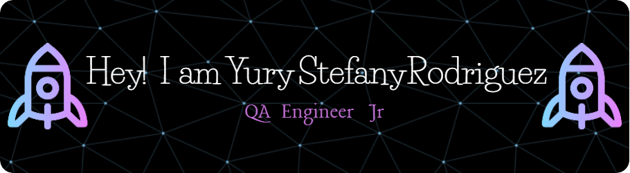

## Hi there 👋

👋Hola, mi nombre es Yury Stefany Rodríguez, aunque la gran mayoría me conocen como Steph.🙂

💥Soy una profesional bilingüe con formación en lenguas extranjeras y una sólida vocación por el aprendizaje continuo.🤓 Durante varios años trabajé como docente de inglés en Colombia, donde desarrollé habilidades clave como la comunicación efectiva, el pensamiento analítico y la empatía. Estas competencias me impulsaron a expandir mi perfil hacia el sector tecnológico, donde encontré en el aseguramiento de calidad de software (QA) una disciplina que conecta perfectamente con mis fortalezas y aspiraciones.🧠

👩‍🎓Recientemente completé un bootcamp intensivo como QA Engineer en TripleTen, donde adquirí conocimientos técnicos y prácticos en herramientas como Python, Selenium, PyCharm, Jira, Postman, GitHub y pruebas de APIs. Me especialicé en pruebas manuales y automatizadas dentro de entornos Agile/Scrum, y participé activamente en el diseño de casos de prueba, la documentación de errores y la validación de funcionalidades clave en proyectos reales.👩‍🏫

✍️Uno de los proyectos trabajados fue Urban Scooter, donde ejecuté pruebas manuales tanto en la web como en dispositivos móviles mediante emuladores. Detecté y reporté bugs relacionados con flujos de pedido, asignación de repartidores y validación de datos, utilizando Jira como herramienta de seguimiento. También validé el comportamiento de APIs y base de datos para asegurar la consistencia del sistema.🫡

✍️En proyectos como Urban Grocers y Urban Routes, trabajé en la automatización de pruebas usando Selenium, Python y Pytest. Validé formularios, comportamiento de elementos web y diseño de interfaz, integrando control de versiones con GitHub y apoyándome en herramientas como Figma para la comparación de diseño funcional vs visual.🫡

💥Mi objetivo actual es incorporarme a una compañía donde pueda poner en práctica mis habilidades como QA Tester Jr., seguir aprendiendo de equipos técnicos con experiencia y contribuir activamente a la mejora continua de productos digitales. Me encanta trabajar en ambientes colaborativos donde el feedback, la comunicación y el crecimiento son parte del día a día.🙋

💥Estoy comprometida con la excelencia, la calidad del producto y el desarrollo profesional constante. Creo firmemente que la tecnología debe estar al servicio de las personas, y es ahí donde quiero seguir generando impacto.👌

🎟️Te invito a conocer más sobre mis proyectos y prácticas en mi portafolio de GitHub.

🤙Si buscas una persona con iniciativa, atención al detalle y muchas ganas de aprender, estaré encantada de formar parte de tu equipo.
